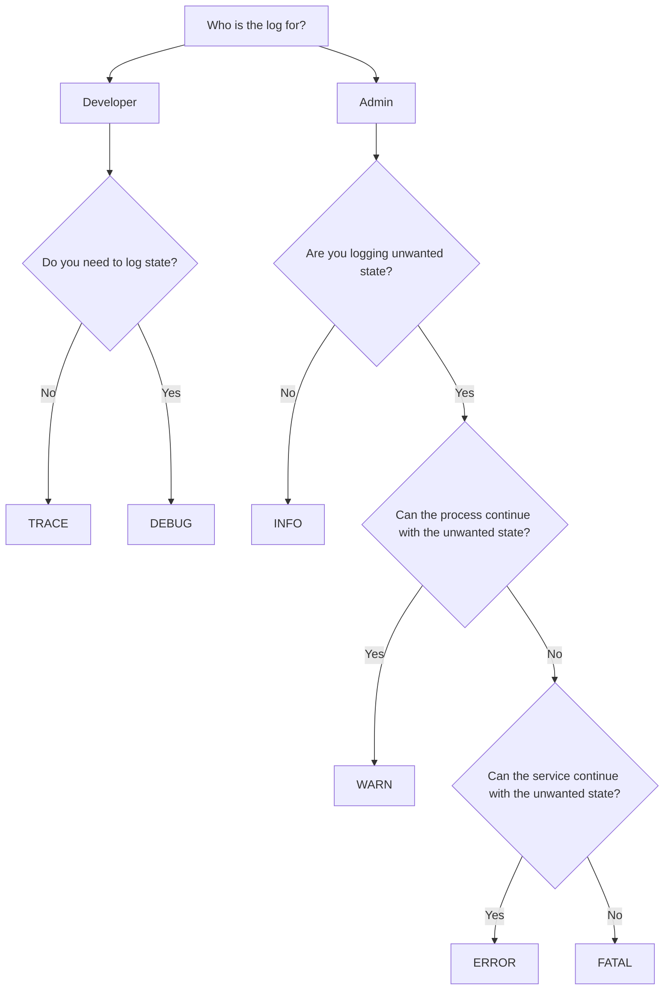

# Log Service

Logs should have the following properties:

| property name | type           | note                                                        |
|---------------|----------------|-------------------------------------------------------------|
| time          | utc            |                                                             |
| tags          | tag object     |                                                             |
| context       | context object |                                                             |
| level         | integer 0 - 5  | see Log Levels below                                        |
| message       | string         |                                                             |
| data          | any            | any data in addition to message; if error, the error object |
| error         | boolean        |                                                             |

### tags object

| property name | type   | note                               |
|---------------|--------|------------------------------------|
| versions      | obj    | { web: `semver` }, TODO detect api |

### context object

| property name | type   | note                       |
|---------------|--------|----------------------------|
| session       | uuid   | session Id if avaliable    |
| module        | string | module name, if set        |
| request       | uuid   | request id, if istrumented |

## Development v Production

There is some variance in logging behavior between production and non-production environments.

Log levels `trace` and `debug` are not logged in production (see log level guidance below).

Until logs are forwarded to persistence, there is no need to alter formatting for storage.

## Log Levels

| Level | Name  | Guidance                                                      |
|-------|-------|---------------------------------------------------------------|
| 5     | Trace | for helping identify execution sequence and code path         |
| 4     | Debug | diagnostic information                                        |
| 3     | Info  | information that is generally helpful                         |
| 2     | Warn  | potentially problematic                                       |
| 1     | Error | errors which prevent the application from running as intended |
| 0     | Fatal | errers which prevent the service from operating; data loss    |

## Logging Decision Tree

